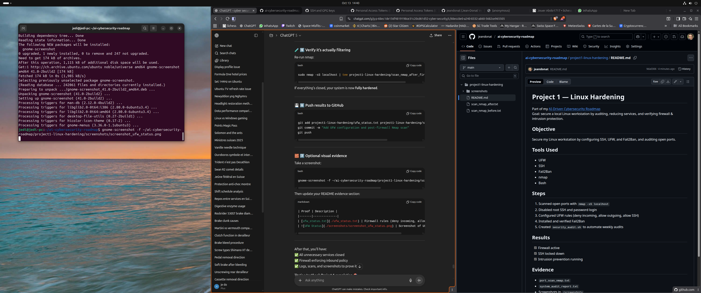

# 🛡️ Project 1 — Linux Hardening
*Part of my [AI-Driven Cybersecurity Roadmap](../README.md)*  

**Goal:** Secure a local Linux workstation by auditing, reducing services, and verifying firewall & intrusion protection.

---

## 🎯 Objective
Strengthen the security posture of my Linux system by:
- Configuring SSH securely (disable root login, password auth)
- Applying firewall rules with UFW
- Enabling Fail2Ban for intrusion prevention
- Auditing open ports and active services

---

## 🧰 Tools Used
- **UFW** – uncomplicated firewall configuration  
- **SSH** – secure remote access and configuration  
- **Fail2Ban** – protection against brute-force attempts  
- **Nmap** – network scanning and port discovery  
- **Bash** – scripting and automation  

---

## 🧩 Steps Performed
1. Scanned open ports with `sudo nmap -sS localhost`  
2. Disabled root SSH login and password authentication  
3. Configured UFW rules:
   - Deny all incoming  
   - Allow all outgoing  
   - Allow SSH (22/tcp)  
4. Installed and verified **Fail2Ban**  
5. Created `security_audit.sh` to automate weekly system audits  
6. Re-scanned system after disabling unnecessary services (CUPS, Avahi)

---

## ✅ Results
- 🟢 Firewall active and enforcing inbound rules  
- 🔐 SSH hardened (no root/password access)  
- 🧱 Intrusion prevention active (Fail2Ban)  
- 🚫 All unnecessary services disabled and ports closed  

---

## 🧾 Evidence

| Proof | Description |
|-------|--------------|
| [ufw_status.txt](./ufw_status.txt) | Firewall rules (deny incoming, allow outgoing) |
| [scan_nmap_before.txt](./scan_nmap_before.txt) | Baseline Nmap scan before hardening |
| [scan_nmap_after_firewall.txt](./scan_nmap_after_firewall.txt) | Verification scan after firewall enabled |
|  | Screenshot of UFW active |

---

## 💡 Lessons Learned
- The default Ubuntu install exposes minimal ports, but disabling local print services (CUPS) further reduces the attack surface.  
- UFW’s simplicity makes it ideal for quick host-level protection.  
- Fail2Ban adds a crucial detection and response layer against brute-force attempts.  
- Proper documentation and version control (Git) are as important as the configuration itself.

---

📅 **Completion Date:** October 2025  
