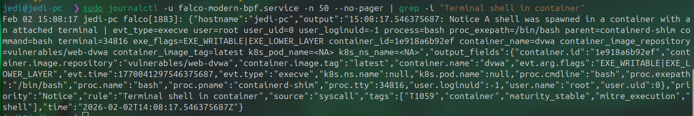

# Project 9 — Final SOC Integration & Reporting

## Goal
Unify visibility, KPIs, and a professional report from the mini-SOC lab.

## Deliverables (target)
- End-to-end architecture diagram (`diagrams/`)
- Executive summary PDF (`report/`)
- Recommendations (`report/` + summarized here)

## Evidence
- KPIs: `evidence/kpis/`
- Screenshots: `evidence/screenshots/`

## Falco Runtime Detection — Container Shell Spawn

**Falco runtime detection of an interactive shell spawned inside a DVWA Docker container, indicating potential post-exploitation or unauthorized container access.**

## Project Outcome

This project demonstrates end-to-end SOC capabilities in a containerized environment:
- Runtime detection of abnormal container behavior using Falco
- Centralized alert ingestion and investigation using Wazuh
- Manual alert correlation based on time, host, and behavior
- Clear incident reporting and executive-level communication

The focus of this project is not tool installation, but analyst reasoning, investigation workflow, and reporting quality.

